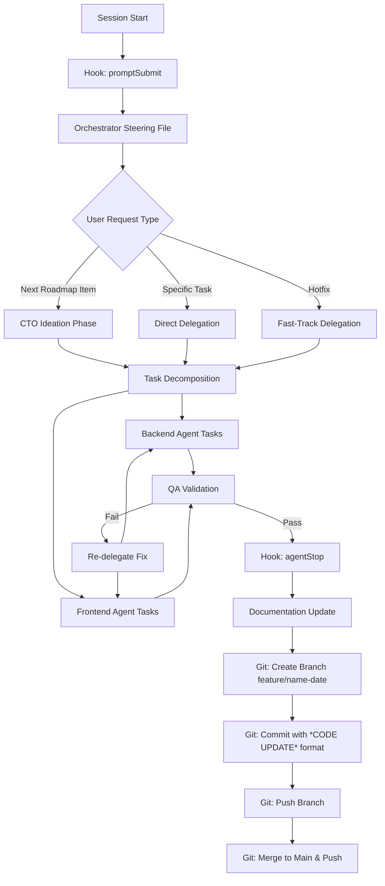
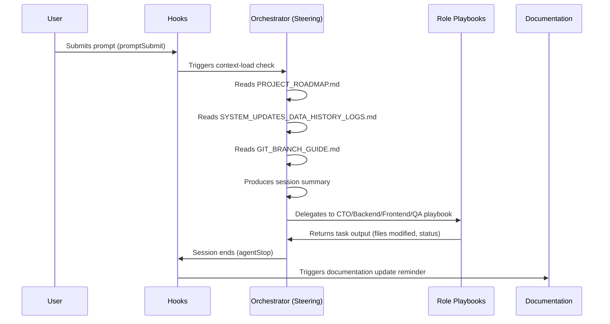

# Design Document: Agentic Team Workflow

## Overview

This design describes a development process automation system for the Car Wash Management System, implemented entirely through Kiro's steering files, hooks, and workflow instruction files. The system formalizes a "Micro-SaaS Agentic Team" — a structured workflow where a Master Orchestrator coordinates specialized agent roles (CTO, Backend, Frontend, QA) through a repeatable execution loop.

The system is NOT a user-facing code feature. It is a set of configuration files that shape how Kiro operates on this project:

1. **Kiro Steering Files** (`.kiro/steering/*.md`) — Always-loaded instructions defining agent behavior and roles
2. **Kiro Hooks** (`.kiro/hooks/`) — Event-triggered automations that enforce the workflow
3. **Workflow Instructions** (`.agents/workflows/`) — Detailed role-specific playbooks (extends existing `instructions.md`)

### Design Rationale

The architecture uses a **single Orchestrator steering file** as the primary entry point, with role-specific playbooks delegated via prompt context. This avoids conflicts between multiple always-loaded steering files competing for control. Hooks enforce critical checkpoints (context loading, documentation updates) without requiring the user to remember manual steps.



## Architecture

### System Components

The system consists of three layers:

| Layer | Purpose | Files |
|-------|---------|-------|
| **Orchestration Layer** | Session protocol, delegation logic, execution loop | `.kiro/steering/orchestrator.md` |
| **Role Playbooks** | Specialized agent instructions per domain | `.agents/workflows/roles/*.md` |
| **Automation Layer** | Event-driven enforcement of workflow steps | `.kiro/hooks/*.json` |

### Data Flow



### Integration with Existing `.agents/workflows/instructions.md`

The existing `instructions.md` file becomes the **foundation reference** — it remains as-is and is referenced by the Orchestrator steering file. The new system layers on top:

- `instructions.md` → General coding guidelines, key file paths, accounts (unchanged)
- `.kiro/steering/orchestrator.md` → Session protocol, delegation logic (new)
- `.agents/workflows/roles/*.md` → Role-specific playbooks (new)

## Components and Interfaces

### Component 1: Orchestrator Steering File

**Path:** `.kiro/steering/orchestrator.md`

**Purpose:** The always-loaded steering file that defines the session protocol, execution loop, and delegation rules. This is the "brain" of the system.

**Structure:**
```markdown
---
inclusion: auto
---

# Orchestrator — Micro-SaaS Agentic Team

## Session Protocol
[Context loading rules, session summary format]

## Execution Loop
[Phase definitions: Context → Ideation → Delegation → Development → Testing → Documentation]

## Delegation Protocol
[How to assign tasks, payload format, dependency tracking]

## Role Dispatch Rules
[When to invoke which role playbook]

## Git Workflow
[Branch naming, commit conventions, push rules]

## Error Handling
[Recovery procedures, escalation rules]
```

**Key Behaviors:**
- On every session start, reads the three context files before any other action
- Produces a session summary (version, last session date, next roadmap item)
- Routes tasks to the correct role playbook based on task type
- Tracks task status throughout the session
- Enforces sequential execution for dependent tasks, parallel for independent ones

### Git Deployment Protocol (Strict)

The Orchestrator enforces the following git workflow after QA passes and documentation is logged:

**Branch Naming Convention:**
- Features: `feature/<feature-name>-<MM-DD-YYYY>` (e.g., `feature/websocket-queue-05-07-2026`)
- Bug fixes: `bugfix/<bugfix-name>-<MM-DD-YYYY>` (e.g., `bugfix/cart-total-calculation-05-07-2026`)
- Date is always today's date in MM-DD-YYYY format

**Commit Message Format:**
```
*CODE UPDATE*
- Added WebSocket endpoint for real-time queue position updates.
- Implemented client-side auto-reconnect logic for dropped connections.
- Updated queue-management.html to show live position changes without polling.
- Added WEBSOCKET_ENABLED env var to toggle feature in production.
```

Rules:
- First line is always `*CODE UPDATE*`
- Each change starts with `- ` on a new line
- Each change is exactly one sentence ending with a period
- All changes from the session are listed

**Push Workflow:**
1. Create branch: `git checkout -b feature/<name>-<MM-DD-YYYY>`
2. Stage specific files: `git add <file1> <file2> ...`
3. Commit with formatted message: `git commit -m "*CODE UPDATE*\n- Change 1.\n- Change 2."`
4. Push branch: `git push -u origin feature/<name>-<MM-DD-YYYY>`
5. Merge to main: `git checkout main && git merge feature/<name>-<MM-DD-YYYY>`
6. Push main: `git push origin main`

This creates a deployment trail in GitHub where every feature/bugfix has its own branch visible in the history.

### Component 2: Role Playbooks

**Path:** `.agents/workflows/roles/`

**Files:**
- `cto-agent.md` — Architecture review, implementation planning, task decomposition
- `backend-agent.md` — FastAPI development, migrations, API patterns
- `frontend-agent.md` — HTML/CSS/JS development, UI patterns, responsiveness
- `qa-agent.md` — pytest testing, validation, deployment gatekeeping

Each playbook contains:
1. **Role Identity** — What this agent is responsible for
2. **Constraints** — What patterns/conventions to follow
3. **Input Format** — What the Delegation_Payload looks like
4. **Output Format** — What to report back to the Orchestrator
5. **Domain-Specific Rules** — Tech stack specifics for this role

### Component 3: Hooks

#### Hook 1: Session Context Loader

**Path:** `.kiro/hooks/session-context-load.json`

**Event:** `promptSubmit`  
**Action:** `askAgent`  
**Purpose:** Ensures context files are read at the start of every session before any development work begins.

```json
{
  "name": "Session Context Loader",
  "description": "Reads project context files at session start to inform all development decisions",
  "eventType": "promptSubmit",
  "hookAction": "askAgent",
  "outputPrompt": "Before responding, read these files to understand current project state: PROJECT_ROADMAP.md (current version, next features), SYSTEM_UPDATES_DATA_HISTORY_LOGS.md (latest changes, version number), GIT_BRANCH_GUIDE.md (branch conventions). Produce a 2-line session summary: current version and next planned item."
}
```

#### Hook 2: Documentation Update Reminder

**Path:** `.kiro/hooks/doc-update-reminder.json`

**Event:** `agentStop`  
**Action:** `askAgent`  
**Purpose:** Reminds the agent to update documentation before the session ends.

```json
{
  "name": "Documentation Update Reminder",
  "description": "Ensures SYSTEM_UPDATES_DATA_HISTORY_LOGS.md and PROJECT_ROADMAP.md are updated after changes",
  "eventType": "agentStop",
  "hookAction": "askAgent",
  "outputPrompt": "Before ending this session, verify: 1) SYSTEM_UPDATES_DATA_HISTORY_LOGS.md has a new entry for this session listing all changes and files modified, 2) PROJECT_ROADMAP.md has completed items marked with [x], 3) Version numbers are updated if features were completed. If any documentation is missing, update it now."
}
```

#### Hook 3: Git Safety Check

**Path:** `.kiro/hooks/git-safety-check.json`

**Event:** `preToolUse`  
**Action:** `askAgent`  
**Tool Types:** `shell`  
**Purpose:** Intercepts git commands to enforce branch naming conventions, commit message format, and the branch-then-merge-to-main workflow.

```json
{
  "name": "Git Safety Check",
  "description": "Validates git operations follow the project's strict branch naming and commit conventions",
  "eventType": "preToolUse",
  "hookAction": "askAgent",
  "toolTypes": "shell",
  "outputPrompt": "If this command involves git operations, enforce these rules strictly: 1) BRANCH NAMING: feature/feature-name-MM-DD-YYYY for features, bugfix/bugfix-name-MM-DD-YYYY for bug fixes (date is today's date). 2) NEVER push directly to main — always create a feature or bugfix branch first, push to that branch, then merge to main. 3) COMMIT MESSAGE FORMAT: First line must be '*CODE UPDATE*' followed by a newline, then each change on its own line starting with '- ' and ending in one sentence. 4) Use -u flag for first push. 5) Stage specific files not 'git add .'. If violations found, suggest the corrected command."
}
```

#### Hook 4: Post-Task QA Trigger

**Path:** `.kiro/hooks/post-task-qa.json`

**Event:** `postTaskExecution`  
**Action:** `askAgent`  
**Purpose:** After a spec task completes, triggers QA validation.

```json
{
  "name": "Post-Task QA Trigger",
  "description": "Triggers QA validation after task completion to catch regressions",
  "eventType": "postTaskExecution",
  "hookAction": "askAgent",
  "outputPrompt": "A development task just completed. Run the QA Agent protocol: 1) Identify what was changed, 2) Run relevant tests from commands/testing/ if they exist, 3) Verify multi-tenant isolation is maintained (business_number scoping), 4) Check that no existing functionality is broken. Report pass/fail status."
}
```

#### Hook 5: Backend File Watcher

**Path:** `.kiro/hooks/backend-file-watch.json`

**Event:** `fileEdited`  
**Action:** `askAgent`  
**File Patterns:** `app/**/*.py`  
**Purpose:** When backend files are modified, validates patterns are followed.

```json
{
  "name": "Backend Pattern Validator",
  "description": "Validates backend changes follow project conventions",
  "eventType": "fileEdited",
  "hookAction": "askAgent",
  "filePatterns": "app/**/*.py",
  "outputPrompt": "A backend Python file was modified. Verify: 1) Data queries are scoped by business_number for multi-tenant isolation, 2) New endpoints use proper Pydantic schemas from app/schemas.py, 3) New routes follow the existing router pattern in app/routers/, 4) If new env vars are needed, they're documented. Flag any violations silently without interrupting flow."
}
```

### Component 4: Delegation Payload Format

The Orchestrator uses a structured format when delegating tasks to role playbooks:

```markdown
## Delegation Payload

**Target Agent:** [Backend_Agent | Frontend_Agent | QA_Agent]
**Task:** [Brief description]
**Scope:**
- Files to create: [list]
- Files to modify: [list]
- Database changes: [yes/no, details]

**Acceptance Criteria:**
1. [Criterion 1]
2. [Criterion 2]

**Dependencies:**
- Depends on: [other task ID or "none"]
- Blocks: [other task ID or "none"]

**Context:**
- Relevant existing patterns: [file references]
- Tech constraints: [any specific constraints]
```

### Component 5: Session State Tracking

The Orchestrator maintains a running session log as a mental model (not persisted to file during the session). At session end, this becomes the documentation update:

```markdown
## Session Log (In-Memory)

**Session Start:** [timestamp]
**Version at Start:** [from SYSTEM_UPDATES_DATA_HISTORY_LOGS.md]
**Tasks:**
| ID | Agent | Description | Status | Files Modified |
|----|-------|-------------|--------|----------------|
| 1  | CTO   | Plan feature X | completed | - |
| 2  | Backend | Add endpoint Y | in-progress | app/routers/x.py |
| 3  | Frontend | Add page Z | pending | - |
| 4  | QA | Validate changes | pending | - |
```

## Data Models

This system does not introduce database models or persistent data structures. All "data" is:

1. **Steering file content** — Markdown files loaded into agent context
2. **Hook configurations** — JSON files defining event-action mappings
3. **Session state** — Ephemeral in-memory tracking during a session
4. **Documentation files** — The existing markdown files that get updated

### File System Layout

```
.kiro/
├── steering/
│   └── orchestrator.md              # Always-loaded session protocol
├── hooks/
│   ├── session-context-load.json    # promptSubmit → read context files
│   ├── doc-update-reminder.json     # agentStop → update docs
│   ├── git-safety-check.json        # preToolUse (shell) → validate git ops
│   ├── post-task-qa.json            # postTaskExecution → run QA
│   └── backend-file-watch.json      # fileEdited (app/**/*.py) → validate patterns
├── specs/
│   └── agentic-team-workflow/       # This spec
│       ├── .config.kiro
│       ├── requirements.md
│       ├── design.md
│       └── tasks.md

.agents/
└── workflows/
    ├── instructions.md              # Existing — general coding guidelines (unchanged)
    └── roles/
        ├── cto-agent.md             # CTO role playbook
        ├── backend-agent.md         # Backend role playbook
        ├── frontend-agent.md        # Frontend role playbook
        └── qa-agent.md              # QA role playbook
```

### Deployment Exclusion (.gitignore)

The following files are development-only references and MUST NOT be included in deployments or pushed to the repository:

**Reference/Workflow Markdown Files:**
- `.kiro/` — All Kiro spec, steering, and hook files (development tooling only)
- `.agents/` — All agent workflow instructions and role playbooks
- `PROJECT_ROADMAP.md` — Internal roadmap tracking
- `SYSTEM_UPDATES_DATA_HISTORY_LOGS.md` — Internal session history
- `GIT_BRANCH_GUIDE.md` — Internal git reference
- `sidebar_visibility_refactor_summary.md` — Internal refactor notes

**Pytest/Test Files:**
- `commands/testing/` — All test scripts
- `test_*.py` — Any root-level test files
- `pytest.ini` / `conftest.py` / `.pytest_cache/` — Pytest configuration

These are added to `.gitignore` to keep the deployed codebase clean. The reference files exist locally for the agentic workflow but are not needed in production.

## Error Handling

### Context File Missing/Unreadable

- **Detection:** Orchestrator steering file instructs to check file existence before reading
- **Response:** Report the missing file name and halt operations with a clear message to the user
- **Recovery:** User fixes the file, then re-triggers the session

### Agent Task Failure

- **Detection:** Role playbook reports failure in its output format
- **Response:** Orchestrator logs the failure, reverts partial changes (via git), and re-delegates with failure context
- **Escalation:** After 3 failed attempts, escalate to user with summary of attempts

### Database Migration Failure

- **Detection:** Backend Agent reports migration script error
- **Response:** Do NOT proceed with dependent code changes. Report migration failure to Orchestrator.
- **Recovery:** Orchestrator presents the error to user for manual resolution

### Documentation Update Failure

- **Detection:** agentStop hook detects documentation wasn't updated
- **Response:** Preserve existing documentation state, retry the update
- **Recovery:** If retry fails, alert user that docs need manual update

### Git State Protection

- **Detection:** preToolUse hook validates all git commands
- **Response:** Block invalid operations (direct push to main without branch, wrong branch naming format, missing date suffix, `git add .`)
- **Recovery:** Suggest corrected command using `feature/<name>-MM-DD-YYYY` or `bugfix/<name>-MM-DD-YYYY` format with proper `*CODE UPDATE*` commit message

### Partial Changes at Session End

- **Detection:** Orchestrator checks for uncommitted changes before session ends
- **Response:** Either commit with proper message or stash changes with a note
- **Recovery:** Next session detects stashed changes and prompts user for resolution

## Testing Strategy

### Why Property-Based Testing Does NOT Apply

This feature consists entirely of:
- **Configuration files** (JSON hooks, markdown steering files)
- **Process definitions** (workflow instructions)
- **Documentation templates** (session log formats)

There are no pure functions, parsers, serializers, or algorithms with input/output behavior to test. PBT requires universally quantified properties over a meaningful input space — configuration files have no such input space.

### Appropriate Testing Approach

**1. Smoke Tests (Configuration Validation)**
- Verify all hook JSON files are valid JSON with required fields
- Verify steering file has correct frontmatter (`inclusion: auto`)
- Verify all referenced file paths exist (context files, role playbooks)
- Verify hook event types are valid Kiro event types

**2. Example-Based Integration Tests**
- Simulate a session start and verify context files are read
- Simulate a backend file edit and verify the pattern validator fires
- Simulate a git command and verify the safety check intercepts it
- Verify delegation payload format is correctly structured

**3. Manual Workflow Validation**
- Run a complete session loop with a small feature task
- Verify documentation is updated at session end
- Verify git operations follow conventions
- Verify QA validation triggers after task completion

**4. Acceptance Testing Checklist**

| Test | Type | Validates |
|------|------|-----------|
| Hook JSON files parse without errors | Smoke | All hooks |
| Steering file loads in Kiro | Smoke | Orchestrator |
| Context files are read on session start | Integration | Req 1 |
| CTO produces implementation plan | Integration | Req 2 |
| Backend follows router patterns | Integration | Req 3 |
| Frontend follows existing UI patterns | Integration | Req 4 |
| QA runs tests after changes | Integration | Req 5 |
| Delegation payload is structured | Integration | Req 6 |
| Docs updated at session end | Integration | Req 7 |
| Git commands follow conventions | Integration | Req 8 |
| Execution loop runs in order | Integration | Req 9 |
| Errors are handled gracefully | Integration | Req 10 |
