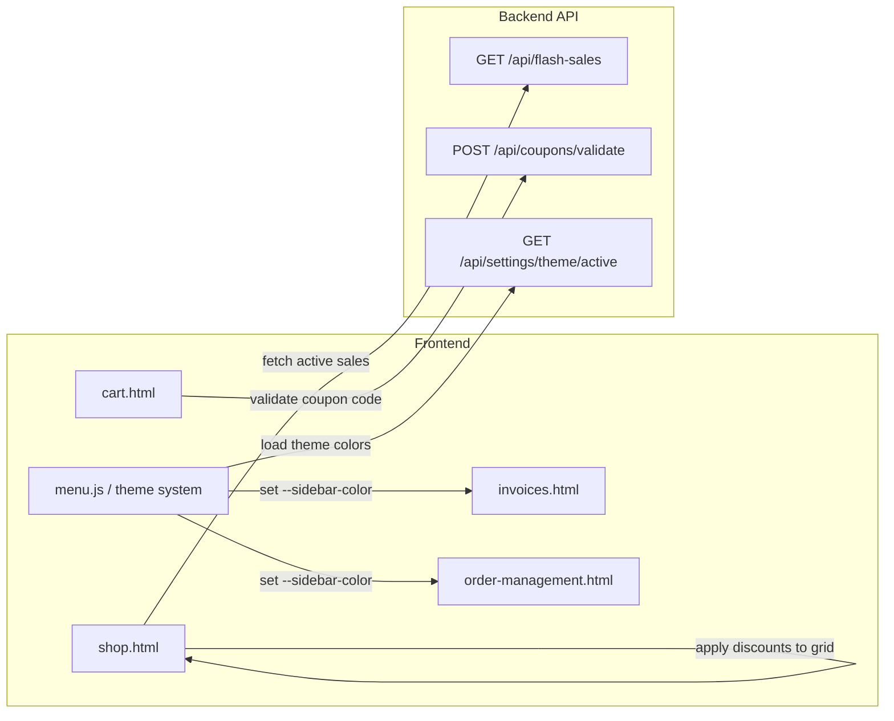

# Design Document: Session 12 – Flash Sale, Coupons & UI Theme Integration

## Overview

This design covers three frontend integration features for the Car Wash Management System:

1. **Flash Sale → Shop Integration**: Connect `shop.html` to the existing `GET /api/flash-sales` endpoint to display real-time flash sale banners, countdown timers, and discounted product prices.
2. **Coupon Validation → Cart**: Enhance `cart.html` to validate coupons exclusively via `POST /api/coupons/validate`, removing any hardcoded test codes and adding proper UX for apply/remove.
3. **UI Theme Adjustments**: Apply the dynamic `--sidebar-color` CSS custom property to specific buttons on `invoices.html` and order card headers on `order-management.html`.

All three features are frontend-only changes that consume existing backend APIs. No new backend endpoints are required — both `/api/flash-sales` and `/api/coupons/validate` already exist and return the needed data.

## Architecture



### Data Flow

1. **Flash Sales**: `shop.html` calls `GET /api/flash-sales` on load → receives array of active sales with `product_ids`, `discount_type`, `discount_value`, `ends_at` → renders banner + applies discounts to product cards.
2. **Coupon Validation**: `cart.html` sends `POST /api/coupons/validate` with `{code, cart_total}` → receives `{valid, discount_amount, discount_type, discount_value}` or HTTP 400/404 with `{detail}` → updates order summary.
3. **Theme Colors**: `menu.js` already fetches the active theme and sets CSS custom properties on `:root`. Pages simply reference `var(--sidebar-color)` in their styles or inline JS.

## Components and Interfaces

### Feature 1: Flash Sale Integration (shop.html)

#### New Function: `loadFlashSales()`

```javascript
async function loadFlashSales() {
    const banner = document.getElementById('flashBanner');
    try {
        const res = await fetch(`${API_BASE}/flash-sales`, {
            headers: { 'Authorization': `Bearer ${getToken()}` }
        });
        if (!res.ok) throw new Error();
        const sales = await res.json();
        if (sales.length === 0) {
            banner.style.display = 'none';
            return;
        }
        activeFlashSale = sales[0]; // first active sale
        renderFlashBanner(activeFlashSale);
        startCountdownFromTimestamp(activeFlashSale.ends_at);
    } catch {
        banner.style.display = 'none';
    }
}
```

#### New Function: `startCountdownFromTimestamp(endsAt)`

Replaces the hardcoded `startCountdown(secs)` with a real timestamp-based countdown:

```javascript
function startCountdownFromTimestamp(endsAt) {
    const endTime = new Date(endsAt).getTime();
    function tick() {
        const remaining = Math.max(0, Math.floor((endTime - Date.now()) / 1000));
        const h = Math.floor(remaining / 3600);
        const m = Math.floor((remaining % 3600) / 60);
        const s = remaining % 60;
        document.getElementById('cdHr').textContent = String(h).padStart(2, '0');
        document.getElementById('cdMin').textContent = String(m).padStart(2, '0');
        document.getElementById('cdSec').textContent = String(s).padStart(2, '0');
        if (remaining <= 0) {
            loadFlashSales(); // re-fetch when expired
            return;
        }
        setTimeout(tick, 1000);
    }
    tick();
}
```

#### Modified Function: `renderGrid()`

Enhanced to overlay flash sale discounts on product cards:

```javascript
function renderGrid() {
    // ... existing filter logic ...
    grid.innerHTML = filtered.map(item => {
        const saleInfo = getFlashSaleDiscount(item.id);
        const displayPrice = saleInfo
            ? saleInfo.discountedPrice
            : item.price;
        const priceHtml = saleInfo
            ? `<span style="text-decoration:line-through;color:#999;font-size:12px;">₱${item.price.toFixed(2)}</span>
               <span class="card-price">₱${displayPrice.toFixed(2)}</span>`
            : `<span class="card-price">₱${item.price.toFixed(2)}</span>`;
        const badgeHtml = saleInfo
            ? `<span class="product-badge" style="background:#e74c3c;">⚡ ${saleInfo.label}</span>`
            : '';
        // ... render card with priceHtml and badgeHtml ...
    }).join('');
}
```

#### New Function: `getFlashSaleDiscount(productId)`

Pure calculation function:

```javascript
function getFlashSaleDiscount(productId) {
    if (!activeFlashSale) return null;
    const ids = activeFlashSale.product_ids || [];
    // Empty array = applies to all products
    if (ids.length > 0 && !ids.includes(productId)) return null;

    const original = allItems.find(i => i.id === productId)?.price || 0;
    let discountedPrice;
    let label;

    if (activeFlashSale.discount_type === 'percentage') {
        discountedPrice = original * (1 - activeFlashSale.discount_value / 100);
        label = `${activeFlashSale.discount_value}% OFF`;
    } else {
        discountedPrice = Math.max(0, original - activeFlashSale.discount_value);
        label = `₱${activeFlashSale.discount_value} OFF`;
    }

    return { discountedPrice: Math.round(discountedPrice * 100) / 100, label };
}
```

### Feature 2: Coupon Validation (cart.html)

#### Modified Function: `applyVoucher()`

The existing implementation already calls `POST /api/coupons/validate`. Changes needed:

1. **Remove hardcoded codes** — The current `cart.html` already uses the API (confirmed in code review). No hardcoded SAVE10/CARWASH50/PROMO20 exist in the current code.
2. **Add coupon display with remove button** — After successful validation, show the applied code with a clear button.
3. **Add auth check** — If no token, show login prompt.

```javascript
async function applyVoucher() {
    const token = getToken();
    if (!token) {
        showToast('Please log in to apply a coupon', 'error');
        return;
    }
    const code = document.getElementById('voucherInput').value.trim().toUpperCase();
    if (!code) { showToast('Please enter a coupon code', 'error'); return; }

    // ... existing fetch logic to /coupons/validate ...

    // On success:
    appliedCoupon = { code: data.code, discount_amount: data.discount_amount };
    discount = data.discount_amount;
    renderAppliedCoupon();
    updateSummary();
}
```

#### New Function: `renderAppliedCoupon()`

```javascript
function renderAppliedCoupon() {
    const container = document.querySelector('.voucher-input-row');
    if (appliedCoupon) {
        container.innerHTML = `
            <div style="display:flex;align-items:center;gap:8px;flex:1;
                        background:var(--brand-light);border:1.5px solid var(--brand);
                        border-radius:6px;padding:9px 12px;">
                <span style="font-size:13px;font-weight:600;color:var(--brand);">
                    🏷️ ${appliedCoupon.code}
                </span>
                <span style="font-size:12px;color:var(--green);margin-left:auto;">
                    -₱${appliedCoupon.discount_amount.toFixed(2)}
                </span>
                <button onclick="removeCoupon()" style="background:none;border:none;
                        cursor:pointer;font-size:16px;color:var(--text-muted);"
                        title="Remove coupon">✕</button>
            </div>`;
    } else {
        container.innerHTML = `
            <input type="text" id="voucherInput" placeholder="Enter voucher / promo code">
            <button class="voucher-apply-btn" onclick="applyVoucher()">Apply</button>`;
    }
}
```

#### New Function: `removeCoupon()`

```javascript
function removeCoupon() {
    appliedCoupon = null;
    discount = 0;
    renderAppliedCoupon();
    updateSummary();
    showToast('Coupon removed', 'success');
}
```

### Feature 3: Theme Color Application

#### invoices.html — Button Theming

The `--sidebar-color` CSS custom property is already set by `menu.js` via `applyThemeColors()`. The buttons need to reference it:

```css
/* Add to invoices.html <style> or inline */
.btn-primary {
    background: var(--sidebar-color, #2c3e50) !important;
}
```

For PDF buttons rendered dynamically in `invoices.js`, apply inline style:

```javascript
// In the render function for invoice table rows:
`<button onclick="downloadPDF(${inv.id})"
    style="background:var(--sidebar-color, #2c3e50);color:white;border:none;
           padding:6px 12px;border-radius:5px;cursor:pointer;">
    PDF
</button>`
```

#### order-management.html — Card Header Theming

Replace the hardcoded gradient with one that uses `--sidebar-color`:

```css
.card-header {
    background: linear-gradient(135deg,
        var(--sidebar-color, #667eea) 0%,
        color-mix(in srgb, var(--sidebar-color, #667eea) 70%, #000) 100%);
    /* ... rest unchanged ... */
}
```

This uses `color-mix()` to create a darker shade of the sidebar color for the gradient end, ensuring the gradient always looks good regardless of the chosen color. White text remains readable because the gradient always produces a dark-enough background.

## Data Models

### Flash Sale API Response (from `GET /api/flash-sales`)

```typescript
interface FlashSale {
    id: number;
    title: string;
    description: string | null;
    discount_type: "percentage" | "fixed";
    discount_value: number;
    starts_at: string;       // ISO 8601
    ends_at: string;         // ISO 8601
    is_active: boolean;
    business_number: string | null;
    product_ids: number[];   // empty = applies to all
    created_at: string;
    deleted_at: string | null;
}
```

### Coupon Validate Request/Response (from `POST /api/coupons/validate`)

```typescript
// Request body
interface CouponValidateRequest {
    code: string;
    cart_total: number;
}

// Success response (200)
interface CouponValidateResponse {
    valid: true;
    code: string;
    description: string | null;
    discount_type: "percentage" | "fixed";
    discount_value: number;
    discount_amount: number;  // pre-calculated
    stock: number | null;
    expires_at: string | null;
}

// Error responses (400/404)
interface CouponErrorResponse {
    detail: string;
    // Examples:
    // "Invalid or expired coupon code"
    // "This coupon has expired"
    // "This coupon is out of stock"
    // "Minimum spend of ₱X.XX required for this coupon"
}
```

### Frontend State (shop.html)

```javascript
let activeFlashSale = null;  // FlashSale | null — the currently active sale
```

### Frontend State (cart.html)

```javascript
let appliedCoupon = null;    // { code: string, discount_amount: number } | null
let discount = 0;            // current discount amount in pesos
```

## Correctness Properties

*A property is a characteristic or behavior that should hold true across all valid executions of a system — essentially, a formal statement about what the system should do. Properties serve as the bridge between human-readable specifications and machine-verifiable correctness guarantees.*

### Property 1: Flash sale discount calculation

*For any* product with price P and any flash sale with discount_type and discount_value V, the calculated discounted price SHALL equal:
- `P * (1 - V/100)` when discount_type is "percentage"
- `max(0, P - V)` when discount_type is "fixed"

**Validates: Requirements 2.2, 2.3**

### Property 2: Flash sale badge targeting

*For any* set of product IDs in a flash sale's `product_ids` array, exactly those products SHALL display a sale badge. If `product_ids` is empty, all products SHALL display a sale badge.

**Validates: Requirements 2.1, 2.5**

### Property 3: Countdown timer calculation

*For any* future `ends_at` timestamp, the countdown display SHALL show the correct hours, minutes, and seconds remaining calculated as `floor((ends_at - now) / 1000)` decomposed into h:m:s.

**Validates: Requirements 1.4**

### Property 4: Coupon discount applied to order summary

*For any* valid coupon response with `discount_amount` D and cart subtotal S, the displayed total SHALL equal `S - D` and the discount row SHALL show D.

**Validates: Requirements 3.2, 3.3**

### Property 5: Coupon error messages displayed

*For any* error response from the Coupons_Validate_API with a `detail` string, that exact string SHALL be displayed to the user as a toast notification.

**Validates: Requirements 3.4**

### Property 6: Coupon removal resets total

*For any* previously applied coupon with discount D, after removal the discount SHALL be 0 and the displayed total SHALL equal the cart subtotal.

**Validates: Requirements 3.6**

### Property 7: Sidebar color applied to themed elements

*For any* valid CSS color value set as `--sidebar-color`, the Create Invoice button, all PDF buttons on the Invoices page, and the order card header gradient on the Order Management page SHALL use that color as their background.

**Validates: Requirements 5.2, 5.3, 6.2**

## Error Handling

| Scenario | Behavior |
|----------|----------|
| `GET /api/flash-sales` returns 401 | Redirect to login (handled by existing `apiRequest` pattern) |
| `GET /api/flash-sales` returns 500 or network error | Hide flash banner silently, products still load normally |
| `GET /api/flash-sales` returns empty array | Hide flash banner, no discounts applied |
| `POST /api/coupons/validate` returns 404 | Show toast: "Invalid or expired coupon code" |
| `POST /api/coupons/validate` returns 400 | Show toast with the `detail` message from response |
| `POST /api/coupons/validate` network error | Show toast: "Failed to validate coupon. Please try again." |
| No auth token when applying coupon | Show toast: "Please log in to apply a coupon" |
| Flash sale `ends_at` is in the past on load | Sale won't appear (backend filters for active sales for clients) |
| `--sidebar-color` not set | Falls back to default values (`#2c3e50` for sidebar, `#667eea` for primary) |

## Testing Strategy

### Unit Tests (Example-Based)

- **Flash banner visibility**: Verify banner hidden when API returns empty/error, visible when sales exist
- **Countdown expiry re-fetch**: Verify `loadFlashSales()` is called when timer hits zero
- **Coupon apply flow**: Verify correct API call with code + cart_total
- **Coupon remove button**: Verify UI shows remove button after successful apply
- **Auth check**: Verify error toast when no token present
- **Theme reactivity**: Verify buttons update when `--sidebar-color` changes dynamically

### Property-Based Tests

Property-based testing is appropriate for the pure calculation logic in this feature (discount calculations, countdown math, coupon total math). The UI rendering and API integration aspects are better covered by example-based tests.

- **Library**: [fast-check](https://github.com/dubzzz/fast-check) (JavaScript PBT library)
- **Minimum iterations**: 100 per property
- **Tag format**: `Feature: session-12-flash-sale-coupons-ui, Property {N}: {title}`

Tests to implement:
1. `getFlashSaleDiscount()` — percentage and fixed calculations (Property 1)
2. Badge targeting logic — product_ids matching (Property 2)
3. Countdown seconds decomposition (Property 3)
4. Order summary total calculation with discount (Property 4)
5. Coupon removal resets state (Property 6)
6. CSS variable application to elements (Property 7)

### Integration Tests

- End-to-end flow: Load shop → verify flash sale banner appears with real API data
- End-to-end flow: Add items to cart → apply coupon → verify discount in summary → checkout
- Theme change: Update theme via settings → verify buttons/headers update on Invoices and Order Management pages
