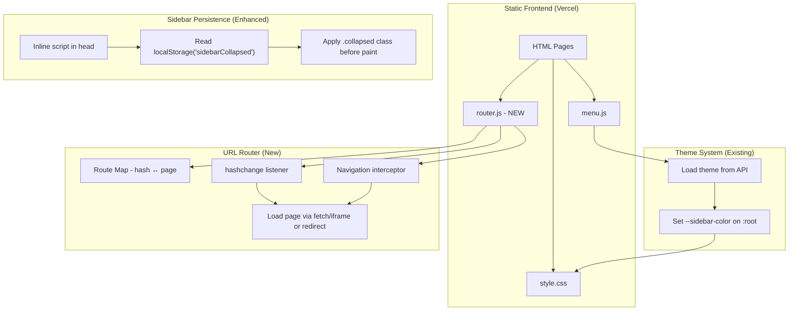
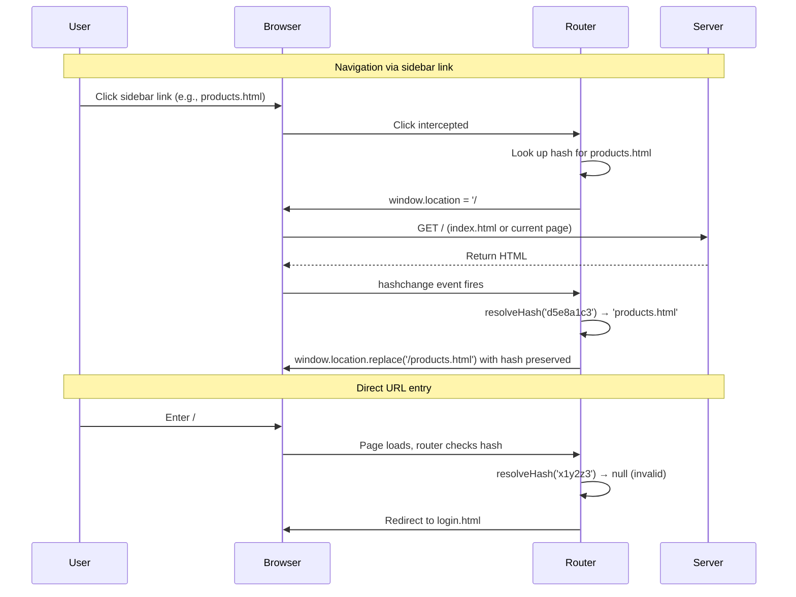

# Design Document: Session 12 UI Polish & Security

## Overview

This design covers five UI/UX improvements and one security enhancement for the Car Wash Management System frontend:

1. **Theme Color Propagation** — CSS rules to apply `var(--sidebar-color)` to action buttons across admin pages
2. **Filter Button Theming** — Active filter button on order management uses the theme color
3. **Sidebar State Persistence** — Eliminate FOUC by applying collapsed state before first paint
4. **URL Obfuscation** — Hash-based routing with a non-reversible lookup table
5. **Sub-Tab Theming** — User Management nav-sub links use sidebar color for active/hover states

The first three features and feature five are CSS/DOM-only changes. Feature four (URL obfuscation) requires a new JavaScript module and modifications to navigation behavior.

## Architecture



### Design Decisions

| Decision | Choice | Rationale |
|----------|--------|-----------|
| Theme propagation approach | CSS-only (add rules to `style.css`) | No JS needed; CSS variables propagate automatically |
| Filter button theming | CSS class + JS update to use `var()` | Replace hardcoded `#667eea` in inline styles with CSS variable reference |
| Sidebar FOUC fix | Inline `<script>` in `<head>` of each page | Must execute synchronously before body renders |
| URL obfuscation strategy | Hash-based routing with static lookup table | Works with Vercel static hosting; no server-side changes needed |
| Page loading mechanism | Full page redirect to actual HTML file (hidden) with hash URL display | Simplest approach for a multi-page static site; avoids SPA complexity |
| Hash generation | Pre-computed random hex strings (not derived from filenames) | Non-reversible; lookup table is the only way to resolve |
| Sub-tab theming | CSS-only using `var(--sidebar-color)` with opacity | Consistent with existing sidebar hover pattern |

## Components and Interfaces

### Component 1: Theme CSS Rules (style.css additions)

**Purpose:** Apply `--sidebar-color` to action buttons and filter buttons via CSS.

**Interface:**
```css
/* Action buttons use sidebar color (excludes delete/danger) */
.btn-primary:not(.btn-danger):not(.btn-delete) { background: var(--sidebar-color); }
.btn-edit { background: var(--sidebar-color); }

/* Active filter button */
.filter-btn.active { background: var(--sidebar-color) !important; border-color: var(--sidebar-color) !important; }

/* Nav sub-link active/hover */
.nav-sub li a:hover,
.nav-sub li a.active { background: color-mix(in srgb, var(--sidebar-color) 40%, transparent); }

.nav-group-header:hover { background: color-mix(in srgb, var(--sidebar-color) 30%, transparent); }
```

### Component 2: Filter Button JS Update (order-management.html)

**Purpose:** Remove hardcoded `#667eea` from the `filterOrders()` function and use CSS classes instead.

**Interface:**
```javascript
function filterOrders(status) {
    currentFilter = status;
    document.querySelectorAll('.filter-btn').forEach(btn => {
        btn.classList.toggle('active', btn.dataset.filter === status);
    });
    renderOrders();
}
```

### Component 3: Sidebar FOUC Prevention (inline script)

**Purpose:** Apply collapsed state before the browser paints the sidebar.

**Interface:**
```html
<!-- In <head> of every page with a sidebar -->
<script>
(function() {
    if (localStorage.getItem('sidebarCollapsed') === '1') {
        document.documentElement.classList.add('sidebar-pre-collapsed');
    }
})();
</script>
```

Combined with CSS:
```css
.sidebar-pre-collapsed .sidebar { width: 76px; padding-left: 10px; padding-right: 10px; overflow: hidden; }
.sidebar-pre-collapsed .content { margin-left: 0; }
```

The existing `DOMContentLoaded` handler in `menu.js` already applies the proper classes; this inline script prevents the flash during the gap between HTML parse and JS execution.

### Component 4: URL Router (router.js — NEW)

**Purpose:** Map obfuscated hash URLs to actual page filenames.

**Interface:**
```javascript
// router.js - URL Obfuscation Module

const ROUTE_MAP = {
    'a3f2b1c8': 'dashboard.html',
    'e7d4c9a2': 'invoices.html',
    'b8f1e3d6': 'order-management.html',
    'c2a9f7b4': 'queue-management.html',
    'd5e8a1c3': 'products.html',
    'f9b2d4e7': 'services.html',
    '1c3e5a7b': 'reports.html',
    '4d6f8b2e': 'settings.html',
    '7a9c1d3f': 'permissions-management.html',
    '2b4e6f8a': 'sidebar-management.html',
    '5c7d9e1b': 'coupon-management.html',
    '8e2a4c6d': 'flash-sale-management.html',
    '3f5b7d9e': 'client-dashboard.html',
    '6a8c2e4f': 'client-orders.html',
    '9b1d3f5a': 'shop.html',
    '0c2e4a6b': 'cart.html',
    '1d3f5b7c': 'reserve.html',
    '4e6a8c0d': 'vouchers.html',
    '7f9b1d3e': 'checkout.html',
    'login':    'login.html'
};

// Reverse map: filename → hash
const PAGE_TO_HASH = Object.fromEntries(
    Object.entries(ROUTE_MAP).map(([hash, page]) => [page, hash])
);

/**
 * Resolve a hash to a page filename.
 * @param {string} hash - The obfuscated hash (without #/)
 * @returns {string|null} The page filename or null if invalid
 */
function resolveHash(hash) { return ROUTE_MAP[hash] || null; }

/**
 * Get the obfuscated hash for a page filename.
 * @param {string} page - The HTML filename
 * @returns {string|null} The hash or null if not mapped
 */
function getHashForPage(page) { return PAGE_TO_HASH[page] || null; }

/**
 * Initialize the router: intercept link clicks, handle hashchange.
 */
function initRouter() { /* ... */ }
```

**Routing Flow:**



**Implementation Strategy:**

Since this is a multi-page static site (not an SPA), the router works as follows:

1. **On every page load**, `router.js` checks if the current URL has a hash fragment (`/#/...`).
2. If a valid hash is present and the current page doesn't match the hash's target, redirect to the correct page.
3. If an invalid hash is present, redirect to login.
4. **All internal links** (sidebar, buttons) are intercepted: instead of navigating directly to `products.html`, the router navigates to `/#/d5e8a1c3` which triggers the hash resolution.
5. **The actual page URL** in the browser shows `/#/d5e8a1c3` while the page content is the real HTML file loaded normally.

**Alternative approach (simpler):** Since Vercel serves static files, we can use a hybrid approach:
- The router updates `window.location.hash` after page load to show the obfuscated hash
- Internal links still navigate to real pages but the URL bar is updated post-load
- This avoids the complexity of intercepting all navigation

**Chosen approach:** Use the simpler post-load hash update combined with a gateway page. Each page includes `router.js` which:
1. On load: replaces the visible URL with `/#/{hash}` using `history.replaceState`
2. On link click: intercepts, navigates to the real page (browser does normal navigation)
3. On direct hash entry: a small `index.html` gateway resolves the hash and redirects

This means:
- Normal page navigation works (Vercel serves static files)
- The URL bar always shows the obfuscated hash
- Direct hash URL entry works via the index.html gateway
- Back/forward works because `history.replaceState` preserves history entries

### Component 5: Sub-Tab Theming (CSS)

**Purpose:** Apply sidebar color to `.nav-sub li a` active/hover and `.nav-group-header` hover.

Already covered in Component 1 CSS rules above.

## Data Models

### Route Map (Static Configuration)

```typescript
interface RouteMap {
    [hash: string]: string;  // hash → page filename
}
```

The route map is a static JavaScript object embedded in `router.js`. No database or API changes required.

**Hash format:** 8-character lowercase hexadecimal strings, randomly generated and hardcoded. Not derived from page names.

### localStorage Keys (Existing)

| Key | Type | Purpose |
|-----|------|---------|
| `sidebarCollapsed` | `'1'` or `''` | Sidebar collapsed state |
| `token` | string | Auth JWT token |
| `selectedTheme` | string | Active theme name |

No new localStorage keys are introduced.

## Correctness Properties

*A property is a characteristic or behavior that should hold true across all valid executions of a system — essentially, a formal statement about what the system should do. Properties serve as the bridge between human-readable specifications and machine-verifiable correctness guarantees.*

### Property 1: Route Map Bijectivity (Round-Trip)

*For any* page filename in the route map, looking up its hash and then resolving that hash back SHALL return the original page filename. Conversely, for any hash in the route map, resolving it to a page and then looking up that page's hash SHALL return the original hash.

**Validates: Requirements 4.1, 4.2, 4.3**

### Property 2: Invalid Hash Rejection

*For any* string that is not a key in the route map, the `resolveHash` function SHALL return `null` (triggering a redirect to login).

**Validates: Requirements 4.4**

### Property 3: Hash Non-Reversibility

*For any* entry in the route map, the hash SHALL NOT be producible by applying common encoding functions (Base64, hex encoding, string reversal, ROT13) to the page filename.

**Validates: Requirements 4.7**

## Error Handling

| Scenario | Handling |
|----------|----------|
| Invalid hash in URL | Redirect to `login.html` |
| Missing `localStorage` for sidebar | Default to expanded state |
| Theme API fails to load | Fall back to localStorage cached theme, then CSS defaults |
| `--sidebar-color` not set | CSS `:root` defaults define fallback (`#2c3e50`) |
| Router script fails to load | Pages still work normally (graceful degradation); URLs just show real filenames |
| Browser doesn't support `history.replaceState` | URL obfuscation degrades gracefully; pages still load |

## Testing Strategy

### Unit Tests (Example-Based)

Most of the acceptance criteria for features 1, 2, 3, and 5 are CSS-only changes that are best verified through:
- **Visual regression tests** or manual inspection
- **DOM assertion tests** that verify computed styles match expected values

Specific example tests:
- Verify `.btn-primary` computed background equals `--sidebar-color` value
- Verify `.btn-delete` retains red background regardless of theme
- Verify `.filter-btn.active` uses sidebar color
- Verify sidebar has `.collapsed` class when `localStorage` has `sidebarCollapsed=1`
- Verify `.nav-sub li a.active` has sidebar-color-derived background

### Property-Based Tests

Property-based testing applies to the URL Router module (Feature 4), which has pure functions with clear input/output behavior and a large input space.

**Library:** fast-check (JavaScript property-based testing library)

**Configuration:** Minimum 100 iterations per property test.

**Tests:**

1. **Route map round-trip** — Tag: `Feature: session-12-ui-polish-security, Property 1: Route map bijectivity round-trip`
2. **Invalid hash rejection** — Tag: `Feature: session-12-ui-polish-security, Property 2: Invalid hash rejection`
3. **Hash non-reversibility** — Tag: `Feature: session-12-ui-polish-security, Property 3: Hash non-reversibility`

### Integration Tests

- Verify that authenticated users can navigate via hash URLs
- Verify that unauthenticated users are redirected to login
- Verify browser back/forward works with hash-based URLs
- Verify sidebar state persists across actual page navigations

### Manual/Visual Tests

- Confirm no FOUC on sidebar collapse across page navigations
- Confirm action buttons visually match sidebar color across all theme presets
- Confirm filter button active state is visually correct
- Confirm sub-tab hover/active states use theme color
